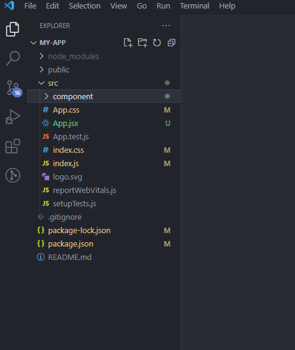
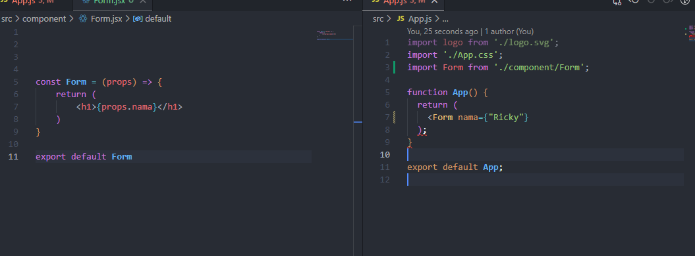
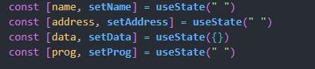

# React Js

- React JS adalah library JavaScript yang biasa digunakan saat membangun UI suatu website atau aplikasi web. 

- React JS bisa dianggap seperti perpustakaan yang berisi berbagai kode JavaScript yang sudah tertulis (pre-written). Anda tinggal mengambil kode yang ingin Anda gunakan.

- React juga memiliki arsitektur berupa component based yang artinya, reusable component atau component yang dapat digunakan berulang kali

- Menggunakan React Js membuat proses coding menjadi lebih efisien. Namun untuk menjalankan Library React.js ini kita membutuhkan engine yang dinamakan Node.js

Terdapat dua fitur tambahan yang menjadi keunggulannya react js:
- JSX => SX adalah extension syntax JavaScript yang memungkinkan Anda untuk memodifikasi Document Object Model (DOM) dengan kode bergaya HTML. setiap jsx memiliki 1 parent element.
- Virtual DOM => Virtual DOM berguna untuk melihat bagian dari DOM asli yang berub

## Instalasi React

- Instal Node.js terlebih dahulu

         https://nodejs.org/en/download

- lalu cek version node yang terinstal

         node -v

- lalu cek juga apakah npm sudah terinstal atau belum 

         npm -v

- instal react dengan mengetikan syntax dibawah 

         npx create-react-app my-app

jika sudah selesai maka akan terdownload file dengan struktur seperti ini

# Component 
> Dalam React Js Component adalah salah satu core penting. Component bekerja dengan cara membagi UI dalam satuan Satuan kecil. Component pada reactjs berfisat reusable code, jadi dapat digunakan berulang kali sesuai dengan kebutuhan dalam mengembangkan sebuah product.

Ada Dua cara dalam membuat Component
1.  Gunakan Function

         function hello(){
            return(
               <>
               <h1>hello World</h1>
               </>
            )
         }

2.  Gunakan Class

         class Hello extends React.Component {

         render() {
            return(
                  

                     Hello Component
                  

            )
            }
         }

# Props & State

## Props

> Prop singkatan dari Property. Prop umumnya digunakan untuk komunikasi data component dari parent komponent ke child component.Prop itu read-only function ini hanya bisa membaca parameter props tetapi tidak bisa merubahnya.

### Contoh Penggunaan Props
    

## State

> State adalah data private sebuah component. Data ini hanya tersedia untuk component tersebut dan tidak bisa di akses dari component lain. Component dapat merubah statenya sendiri.

### Contoh Pembuatan State 

